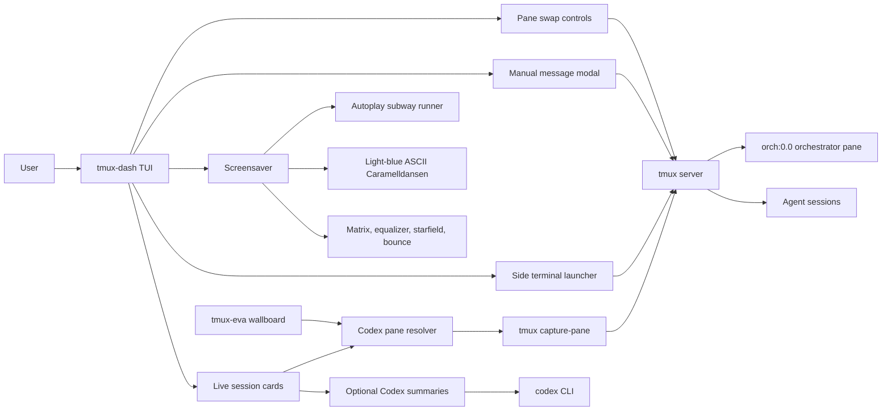
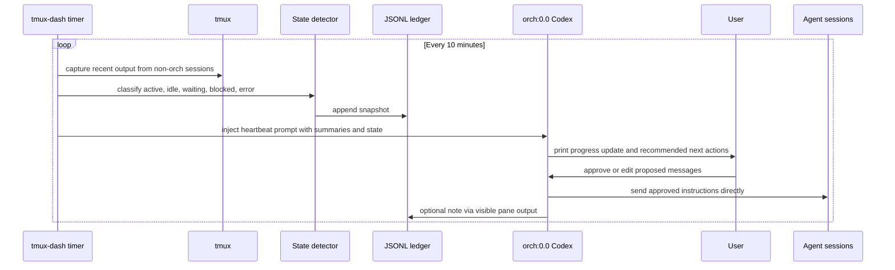

# tmux-dash System Design

`tmux-dash` is a terminal control surface for a multi-agent tmux workspace. It
does not replace the orchestrator agent. Its job is to keep the user and the
orchestrator informed, make pane control fast, and provide enough state to spot
idle or blocked sessions.

## Current Architecture



## Feature Map

| Feature | Status | Owner |
| --- | --- | --- |
| Live cards for tmux sessions | Current | `tmux-dash` |
| Optional AI summaries from recent pane output | Current | `tmux-dash` + `codex` CLI |
| Swap a session into the orchestrator pane | Current | `tmux-dash` |
| Restore the orchestrator pane | Current | `tmux-dash` |
| Manual message sending to a session | Current | `tmux-dash` |
| Side terminal split below the displayed Codex pane | Current | `tmux-dash` |
| Animated screensaver with visible session cards | Current | `tmux-dash` |
| Configurable session order, exclusions, subsessions, and orchestrator target | Current | `tmux-dash` |
| Idle, blocked, waiting, and error detection | Current | `tmux-dash` |
| Status badges on session cards | Current | `tmux-dash` |
| JSONL progress ledger | Current | `tmux-dash` |
| 10-minute orchestrator heartbeat prompt | Current | `tmux-dash` scheduler + orchestrator Codex |
| Read-only second-monitor wallboard | Current | `tmux-eva` |

## Heartbeat Loop

The heartbeat loop should keep all orchestration decisions centered in the
orchestrator pane. `tmux-dash` collects context and injects a status prompt. The
orchestrator Codex summarizes, asks the user for approval, and sends approved
messages to the other sessions directly.



## Heartbeat Responsibilities

`tmux-dash` should:

- Capture recent output from configured non-orchestrator sessions.
- Resolve agent sessions to their main Codex pane (`session:0.0`) rather than
  tmux's active pane, so side terminals do not drive status labels.
- Detect coarse state such as `active`, `idle`, `waiting`, `blocked`, and
  `error`.
- Treat Codex `Working`, `Pursuing goal`, and background-job markers as active
  work even when the visible pane text is stable.
- Record heartbeat snapshots to a local JSONL progress ledger.
- Inject a concise status prompt into `orch:0.0` on a configurable interval.
- Avoid injecting while the orchestrator pane appears busy, unless manually
  triggered.

The orchestrator Codex should:

- Summarize current progress across sessions in its own pane.
- Recommend next actions for the user to approve.
- After approval, send messages directly to the target tmux sessions.
- Preserve user-defined operational constraints.

## Configuration Shape

```toml
[orchestrator]
enabled = true
target = "orch:0.0"
heartbeat_secs = 600
idle_after_secs = 900
quiet_secs = 20
submit_keys = ["Tab", "Enter"]
ledger_path = "~/.local/state/tmux-dash/orchestrator.jsonl"

[status]
detect_tracebacks = true
detect_repeated_output = true
detect_waiting_prompts = true

[sessions.programBench]
label = "ProgramBench eval"

[sessions.balrogRL]
label = "BALROG RL"
```

Session metadata is optional and should describe subsessions or agent sessions
only. The orchestrator remains the place where goals, approvals, and decisions
are discussed.

## Second-Monitor Wallboard

`tmux-eva` is a separate read-only Textual app for a dedicated monitor. It uses
the same config, session discovery, Codex-pane resolver, and status detector as
`tmux-dash`, but it does not expose any controls that mutate tmux sessions. It
uses an original black/red/orange/green command-system theme and renders:

- Global phase: `NOMINAL`, `WATCH`, or `ALERT`.
- Operation mode: `NORMAL OPERATION`, `OBSERVATION WATCH`,
  `COMMAND INTERRUPT`, or `FAULT CASCADE`.
- Counts for active, idle, waiting, blocked, and error sessions.
- Unit rows for each session with sync-style meters, power state, and
  authorization/border state.
- Diagnostic bus rows under the unit matrix so the wallboard stays visually
  dense even when there are only a few active sessions.
- A focused unit diagnostic panel with a derived signal waveform, recent
  terminal signal, active Codex markers, link-lattice rows, and auxiliary
  background-job count.
- Limiter checks, register-noise rows, and border-field maps that are generated
  from session digests to keep tall monitor layouts filled.
- A tri-core decision panel that votes from logic, ops, and link perspectives.
- A command-protocol countdown based on the heartbeat cadence.
- A command log derived from current session status and auxiliary job state.
- A repeating protocol tape for dense right-rail telemetry.
- An alert cascade for non-active sessions and active background-job markers.

The focused unit rotates every 15 seconds, while `n` can still advance it
manually and `p` can pause the wallboard.
