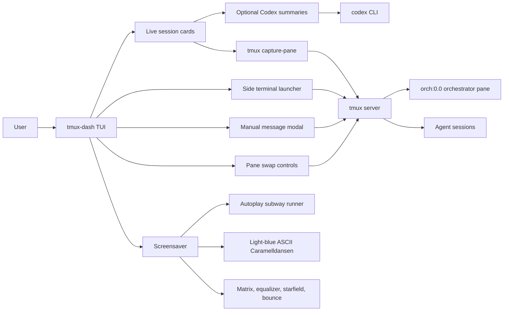
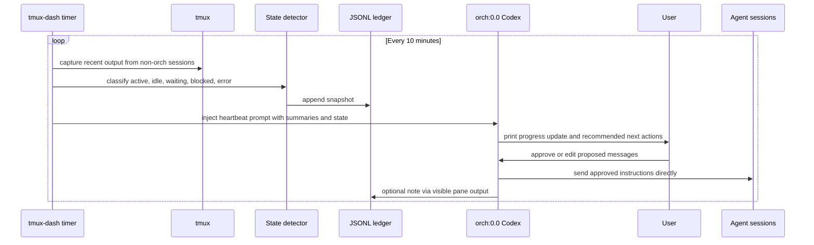

# tmux-dash System Design

`tmux-dash` is a terminal control surface for a multi-agent tmux workspace. It
does not replace the orchestrator agent. Its job is to keep the user and the
orchestrator informed, make pane control fast, and provide enough state to spot
idle or blocked sessions.

## Current Architecture



## Feature Map

| Feature | Status | Owner |
| --- | --- | --- |
| Live cards for tmux sessions | Current | `tmux-dash` |
| Optional AI summaries from recent pane output | Current | `tmux-dash` + `codex` CLI |
| Swap a session into the orchestrator pane | Current | `tmux-dash` |
| Restore the orchestrator pane | Current | `tmux-dash` |
| Manual message sending to a session | Current | `tmux-dash` |
| Side terminal for a session | Current | `tmux-dash` |
| Animated screensaver with visible session cards | Current | `tmux-dash` |
| Configurable session order, exclusions, subsessions, and orchestrator target | Current | `tmux-dash` |
| Idle, blocked, waiting, and error detection | Planned | `tmux-dash` |
| Status badges on session cards | Planned | `tmux-dash` |
| JSONL progress ledger | Planned | `tmux-dash` |
| 10-minute orchestrator heartbeat prompt | Planned | `tmux-dash` scheduler + orchestrator Codex |

## Planned Heartbeat Loop

The heartbeat loop should keep all orchestration decisions centered in the
orchestrator pane. `tmux-dash` collects context and injects a status prompt. The
orchestrator Codex summarizes, asks the user for approval, and sends approved
messages to the other sessions directly.



## Heartbeat Responsibilities

`tmux-dash` should:

- Capture recent output from configured non-orchestrator sessions.
- Detect coarse state such as `active`, `idle`, `waiting`, `blocked`, and
  `error`.
- Record heartbeat snapshots to a local JSONL progress ledger.
- Inject a concise status prompt into `orch:0.0` on a configurable interval.
- Avoid injecting while the orchestrator pane appears busy, unless manually
  triggered.

The orchestrator Codex should:

- Summarize current progress across sessions in its own pane.
- Recommend next actions for the user to approve.
- After approval, send messages directly to the target tmux sessions.
- Preserve user-defined operational constraints.

## Planned Configuration Shape

```toml
[orchestrator]
enabled = true
target = "orch:0.0"
heartbeat_secs = 600
idle_after_secs = 900
ledger_path = "~/.local/state/tmux-dash/orchestrator.jsonl"

[status]
detect_tracebacks = true
detect_repeated_output = true
detect_waiting_prompts = true

[sessions.programBench]
label = "ProgramBench eval"

[sessions.balrogRL]
label = "BALROG RL"
```

Session metadata is optional and should describe subsessions or agent sessions
only. The orchestrator remains the place where goals, approvals, and decisions
are discussed.
